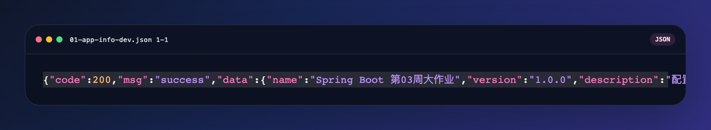
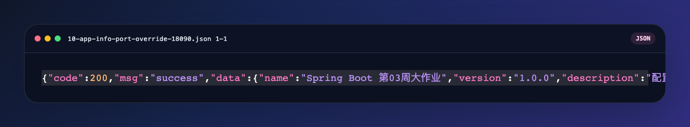
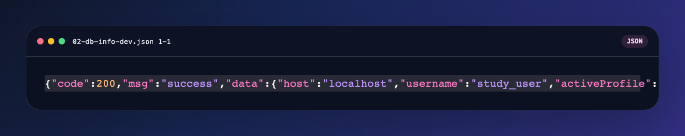
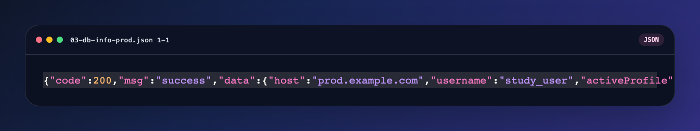
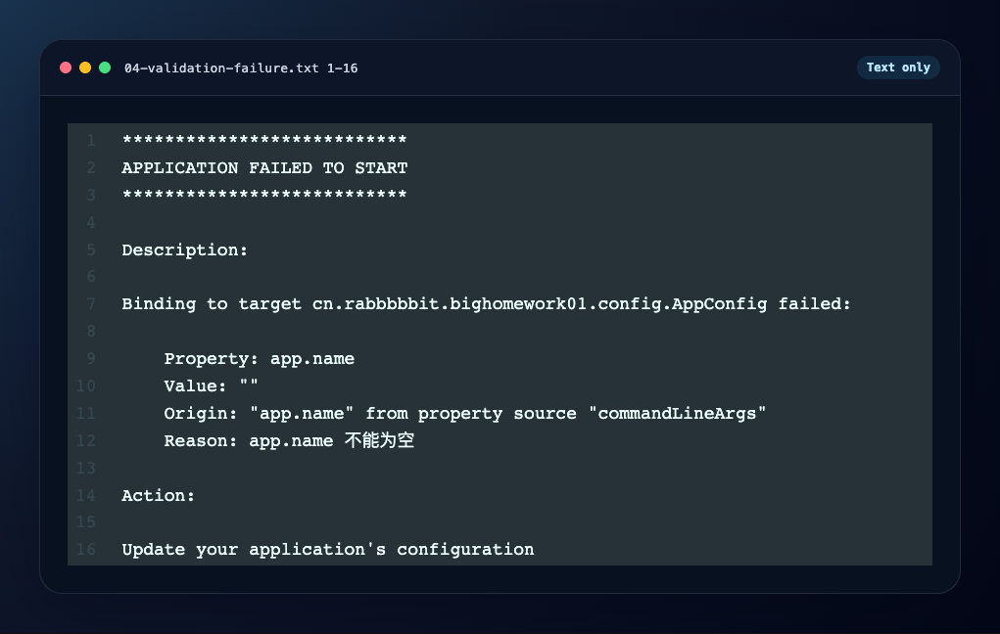
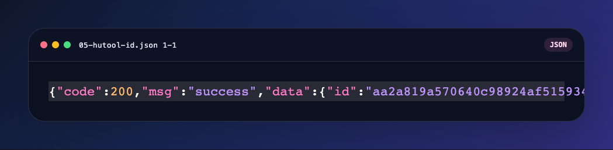
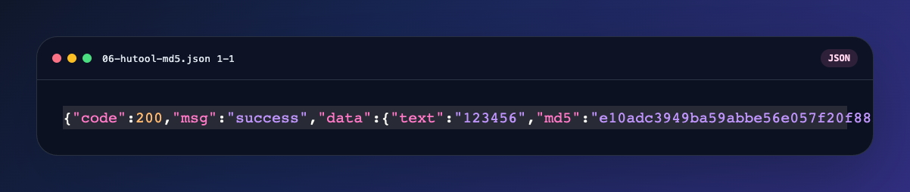
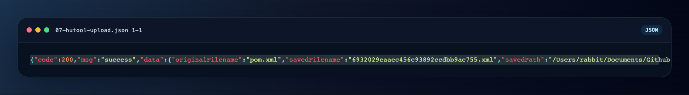
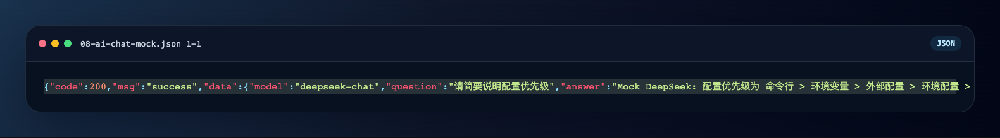
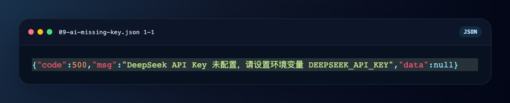

# 第 03 周大作业测试报告

## 1. 项目说明

- 项目目录：`/Users/rabbit/Documents/Github/springboot-study/big-homework01`
- 运行环境：`Java 17`、`Spring Boot 3.5.12`、`Maven Wrapper`
- 完成范围：全部必做项 + `A1 A2 A3 A4 A7 A8 A9 A10 A11`

## 2. 配置管理

### 2.1 AppConfig 配置类

- 绑定类：`AppConfig`
- 前缀：`app`
- 字段：`name / version / description / uploadDir / database.host / database.username / database.password`
- 校验：`@Validated + @NotBlank(message = "app.name 不能为空")`

### 2.2 GET /api/config/app-info

- 请求方式：`GET`
- URL：`http://127.0.0.1:8080/api/config/app-info`
- 说明：返回完整业务配置和 `server.port`



响应示例：

```json
{"code":200,"msg":"success","data":{"name":"Spring Boot 第03周大作业","version":"1.0.0","description":"配置管理与多环境管理综合练习项目","uploadDir":"uploads","database":{"host":"localhost","username":"study_user","password":"dev-password"},"serverPort":8080,"activeProfiles":["dev"]}}
```

### 2.3 端口读取验证

- 配置读取方式：`@Value("${server.port}")`
- 自动化测试：`ConfigControllerPortOverrideTest`
- 手工验证说明：`2026-03-24` 本机 `9090` 被 HBuilderX `uni --platform h5` 占用，因此手工演示改用 `18090`；自动化测试仍断言 `9090` 覆盖成功



## 3. 多环境

### 3.1 dev 环境

- 启动方式：`java -jar target/big-homework01-0.0.1-SNAPSHOT.jar`
- 期望数据库地址：`localhost`



### 3.2 prod 环境

- 启动方式：`java -jar target/big-homework01-0.0.1-SNAPSHOT.jar --spring.profiles.active=prod --server.port=18081`
- 期望数据库地址：`prod.example.com`



响应示例：

```json
{"code":200,"msg":"success","data":{"host":"prod.example.com","username":"study_user","activeProfile":"prod"}}
```

## 4. 配置校验

### 4.1 删除 app.name 后启动失败

- 验证命令：`java -jar target/big-homework01-0.0.1-SNAPSHOT.jar --app.name=`
- 结果：应用启动失败，输出配置校验错误



## 5. Hutool

### 5.1 GET /api/hutool/id

- 请求方式：`GET`
- URL：`http://127.0.0.1:8080/api/hutool/id`



### 5.2 GET /api/hutool/md5?text=123456

- 请求方式：`GET`
- URL：`http://127.0.0.1:8080/api/hutool/md5?text=123456`
- 期望结果：`e10adc3949ba59abbe56e057f20f883e`



### 5.3 POST /api/hutool/upload

- 请求方式：`POST`
- URL：`http://127.0.0.1:8080/api/hutool/upload`
- 参数：`multipart/form-data`，字段名 `file`
- 本次上传文件：`pom.xml`



## 6. 综合接口

### 6.1 POST /api/unified/ai/chat

- 请求方式：`POST`
- URL：`http://127.0.0.1:18082/api/unified/ai/chat`
- 请求体：

```json
{"question":"请简要说明配置优先级"}
```

- 说明：当前仓库未存放真实 `DEEPSEEK_API_KEY`。本报告采用本地 mock DeepSeek 服务进行联调，验证配置读取、Hutool HTTP 调用和统一返回格式。



### 6.2 统一异常格式

- 未配置 API Key 时，接口返回：



## 7. 进阶内容完成情况

- [x] `A1` 配置优先级说明文档
- [x] `A2` 命令行端口覆盖验证
- [x] `A3` 生产环境数据库密码使用 `${DB_PASSWORD}` 注入
- [x] `A4` 生产环境敏感信息不写死，统一使用占位符或环境变量
- [x] `A7` `UnifiedController` 统一 AI 接口路径到 `/api/unified`
- [x] `A8` 全局异常处理，统一 `Result<T>` 错误格式
- [x] `A9` 使用 Hutool HTTP 模块调用 DeepSeek 风格接口
- [x] `A10` AI 地址、密钥、模型全部从配置读取
- [x] `A11` 完整测试报告与 PDF

## 8. 自动化测试结果

执行命令：

```bash
./mvnw test
```

结果：

- 共执行 `15` 个测试
- 失败 `0`
- 错误 `0`

## 9. 结论

本项目已完成作业要求的全部必做项，并补充了与 DeepSeek 路线对应的高价值加分项。代码、配置、测试与报告均可在 `big-homework01` 目录内独立复现。
